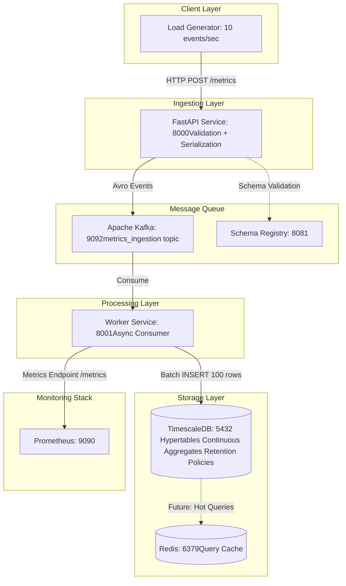

# Realtime-Analytics-Platform-V2
New folder structure for existing project (its visibility changed)

A distributed high-performance, multi-tenant analytics platform capable of ingesting, processing, and serving real-time metrics. This project demonstrates distributed system patterns, event-driven architecture, and time-series data management.

---

## Current Architecture



---

## Tech Stack

- **Database:** PostgreSQL + TimescaleDB (16 + 2.25.0) -> Time-series storage
- **Message Queue** Apache Kafka (Kraft Latest) -> Event streaming
- **Schema Registry** Confluent Schema Registry (7.6.0) -> Avro schema management
- **API Framework** FastAPI (Latest) -> Ingestion endpoints
- **Language:** Python (3.13) -> Ingestion endpoints
- **Cache** Redis (7) -> Future query result cache
- **Monitoring** Prometheus (Latest) -> Metrics collection (Grafana, OpenTelemetry in the future)
- **Orchestration** Docker Compose -> Local development

---

## Roadmap & Progress

### Phase 1: Foundation
- [x] Project structure setup with `uv` workspaces
- [x] Docker Compose environment (Postgres/Timescale, Redis)
- [x] Ingestion Service skeleton (FastAPI)
- [x] Database connection (SQLAlchemy Async)
- [x] Basic health checks & structured logging

### Phase 2: Kafka Integration
- [x] Add Kafka to Docker Compose
- [x] Implement Kafka Producer in Ingestion Service
- [x] Implement Schema Registry (Avro)
- [x] Create Consumer Service (Worker)
- [x] End-to-end data flow (API -> Kafka -> DB)

### Phase 3: Time-Series
- [x] Enable TimescaleDB hypertables
- [x] Implement continuous aggregations (1min, 1hour)
- [x] Automated refresh policies
- [x] Retention policies (30d/90d/365d)
- [x] Optimize query performance

### Phase 4: Query Service API
- [ ] REST API for metric queries
- [ ] Smart granularity selection (1-min vs 1-hour)
- [ ] Redis caching for hot queries
- [ ] Pagination (max 1000 data points per response)
- [ ] Query validation (prevent full table scans)

### Phase 5: Multi-tenancy & Scaling
- [x] Tenant isolation
- [ ] API Rate limiting & Circuit breakers
- [ ] Versioning (v1/v2)
- [ ] Horizontal scaling (multiple workers, read replicas)
- [ ] TimescaleDB compression (10x storage reduction)
- [ ] Compression policies
- [ ] Storage monitoring


### Phase 6: Observability & Alerting
- [x] Prometheus metrics export
- [ ] Grafana Dashboards
- [ ] OpenTelemetry Tracing
- [ ] Load testing (Locust)
- [ ] Alerting rules engine

### Phase 7: Advanced Features
- [ ] Multi-region replication (TimescaleDB distributed hypertables)
- [ ] Anomaly detection (ML on continuous aggregates)
- [ ] Forecasting (predict future resource usage)
- [ ] Data retention UI (let users customize retention per tenant)
- [ ] Cost allocation (charge tenants based on storage/query usage)

### Phase 8: Documentation & Testing
- [ ] API Documentation
- [ ] Unit tests
- [ ] Integration tests
- [ ] End-to-end tests

--- 

## Quick Start

```bash
# 1. Start infrastructure
docker-compose up -d

# 2. Run migrations
cd migrations
uv run apply_migrations.py

# 3. Backfill continuous aggregates
bash scripts/backfill_continuous_aggregates.sh

# 4. Start services
cd services/ingestion && bash run.sh  # Terminal 1
cd services/worker && bash run.sh     # Terminal 2

# 5. Generate load
cd tools/load_generator
python generator.py --rate 10
```

---

## Current Performance

* Throughput: 10 events/sec (scalable to 1000+)
* Query Speedup: 50-100x (continuous aggregates vs raw table)
* Storage Efficiency: 87% reduction (with tiered retention)
* Compression Ratio: 39x (1-min), 554x (1-hour)


