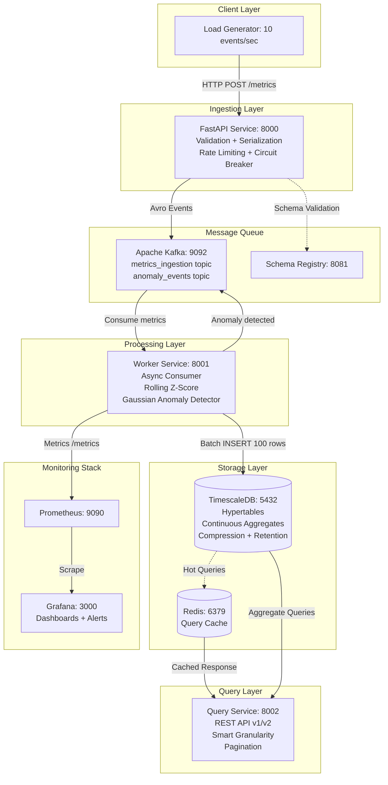
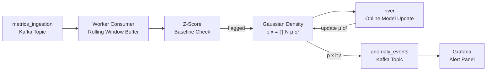

# Realtime-Analytics-Platform-V2

A distributed, high-performance, multi-tenant analytics platform capable of ingesting, processing, and serving real-time metrics — with an **AI-powered anomaly detection engine** running directly on the stream.

This project demonstrates production-grade distributed system patterns: event-driven architecture, time-series data management, and real-time ML inference inside a Kafka consumer.

---

## Current Architecture



---

## Tech Stack

| Component | Technology | Role |
|---|---|---|
| **Language** | Python 3.13 | All services |
| **API Framework** | FastAPI (Latest) | Ingestion + Query endpoints |
| **Database** | PostgreSQL + TimescaleDB (16 + 2.25.0) | Time-series storage |
| **Message Queue** | Apache Kafka (KRaft) | Event streaming |
| **Schema Registry** | Confluent Schema Registry (7.6.0) | Avro schema management |
| **Cache** | Redis 7 | Query result cache |
| **Monitoring** | Prometheus + Grafana | Metrics + Dashboards |
| **Orchestration** | Docker Compose | Local development |
| **ML** | `statistics` (stdlib) → `river` | Online anomaly detection |

---

## Roadmap & Progress

### Phase 1: Foundation
- [x] Project structure setup with `uv` workspaces
- [x] Docker Compose environment (Postgres/Timescale, Redis)
- [x] Ingestion Service skeleton (FastAPI)
- [x] Database connection (SQLAlchemy Async)
- [x] Basic health checks & structured logging

### Phase 2: Kafka Integration
- [x] Add Kafka to Docker Compose
- [x] Implement Kafka Producer in Ingestion Service
- [x] Implement Schema Registry (Avro)
- [x] Create Consumer Service (Worker)
- [x] End-to-end data flow (API → Kafka → DB)

### Phase 3: Time-Series
- [x] Enable TimescaleDB hypertables
- [x] Implement continuous aggregations (1min, 1hour)
- [x] Automated refresh policies
- [x] Retention policies (30d / 90d / 365d)
- [x] Optimize query performance

### Phase 4: Query Service API
- [x] REST API for metric queries
- [x] Smart granularity selection (1-min vs 1-hour aggregates)
- [x] Redis caching for hot queries
- [x] Pagination (max 1000 data points per response)
- [x] Query validation (prevent full table scans)

### Phase 5: Multi-Tenancy & Scaling ← CURRENT
- [x] Tenant isolation
- [ ] **5.1** - API Rate Limiting (sliding window, per-tenant) + Circuit Breaker
- [ ] **5.2** - TimescaleDB Compression (10x storage reduction) + Storage Monitoring

### Phase 6: Lean Observability
- [ ] **6.1**: Grafana Dashboards (ingestion throughput, query latency, storage)
- [ ] **6.2**: Prometheus alerting rule (anomaly precursor signal)

### Phase 7: AI Capstone - Real-Time Anomaly Detection
> *Implements Andrew Ng's CS229 Gaussian density estimation directly inside the Kafka consumer stream.*

- [ ] **7.1**: Statistical baseline: Rolling Z-Score detector on the stream
- [ ] **7.2**: CS229 from scratch: Gaussian density estimation (µ, σ², ε threshold) (TBD)
  ```
  p(x) = ∏ [ 1/(√2π·σⱼ) · exp(-(xⱼ - µⱼ)² / 2σⱼ²) ]
  Flag as anomaly when p(x) < ε
  ```
- [ ] **7.3**: `river` online learning, model parameters update *with* the stream
- [ ] **7.4**: Anomaly events → dedicated `anomaly_events` Kafka topic → Grafana alert panel

---

## Architecture: Anomaly Detection Flow (Phase 7 Target)



---

## Quick Start

```bash
# 1. Start infrastructure
docker-compose up -d

# 2. Run migrations
cd migrations
uv run apply_migrations.py

# 3. Backfill continuous aggregates
bash scripts/backfill_continuous_aggregates.sh

# 4. Start services
cd services/ingestion && bash run.sh   # Terminal 1
cd services/worker && bash run.sh      # Terminal 2
cd services/query && bash run.sh       # Terminal 3

# 5. Generate load
cd tools/load_generator
python generator.py --rate 10
```

---

## Current Performance

| Metric | Value |
|---|---|
| Throughput | 10 events/sec (scalable to 1000+) |
| Query Speedup | 50–100x (continuous aggregates vs raw table) |
| Storage Efficiency | 87% reduction (tiered retention) |
| Compression Ratio | 39x (1-min agg), 554x (1-hour agg) |
| Anomaly Detection Latency | < 50ms per event (target, Phase 7) |
